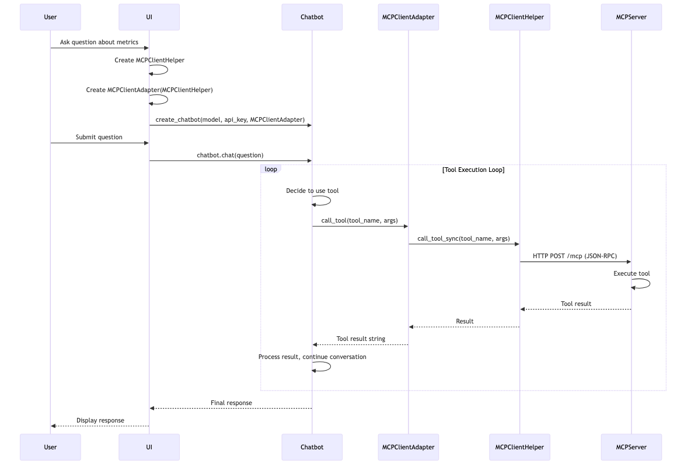
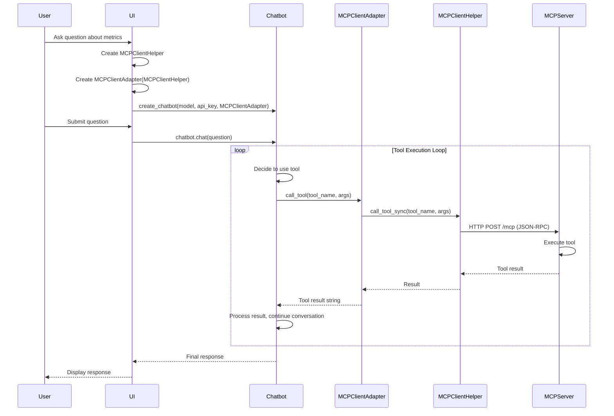
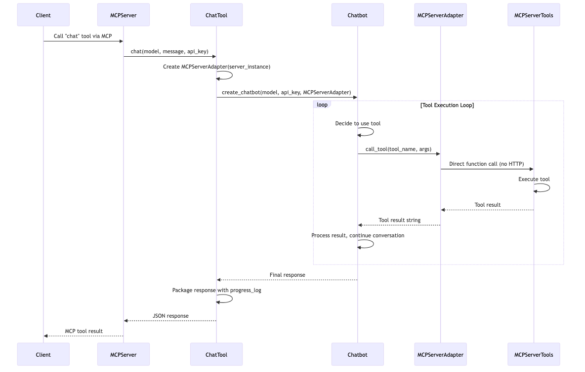
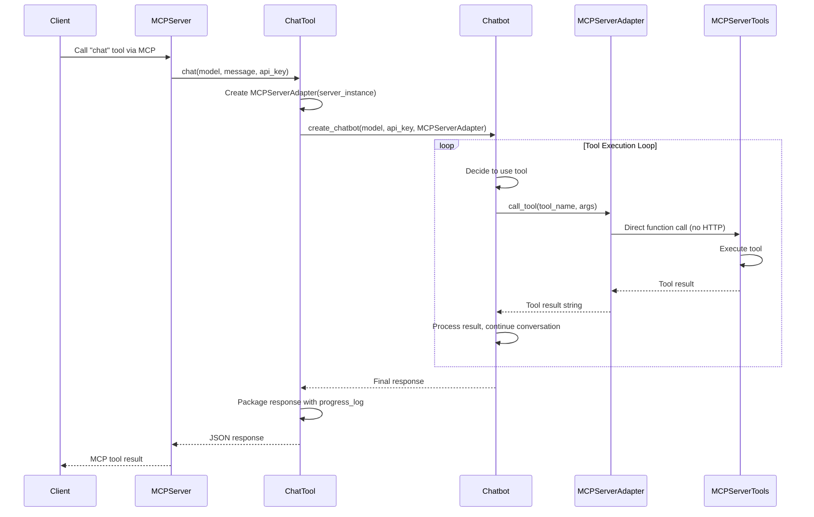
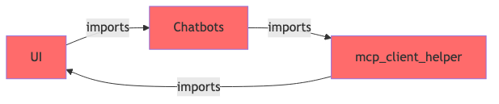
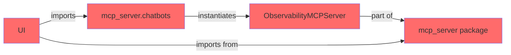
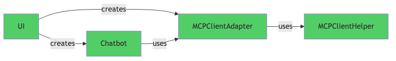
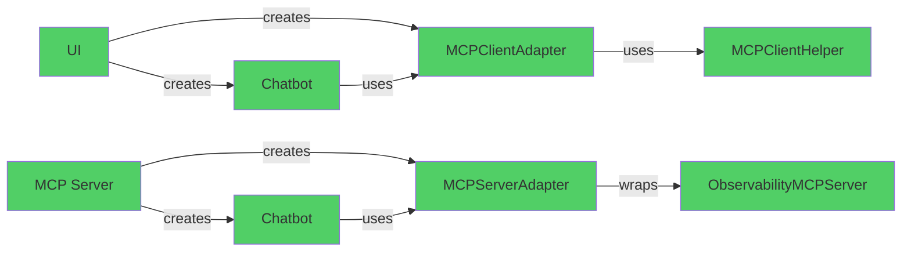

# Chatbots Architecture & Usage Guide

## Overview

The chatbots module provides a unified interface for interacting with AI models (both local and cloud-based) to enable natural language queries across the observability platform. Chatbots power the **"Chat with Prometheus"** feature in the UI and can be used via the `chat` MCP tool for external clients.

Chatbots execute MCP (Model Context Protocol) tools to gather data from multiple observability sources:
- **Prometheus metrics** - Query metrics using PromQL
- **Tempo traces** - Analyze distributed traces
- **OpenShift metrics** - Kubernetes cluster and pod metrics
- **vLLM metrics** - AI/ML model serving metrics
- **Korrel8r** - Correlated observability data (alerts, logs, traces, metrics)

The chatbots then use AI models to provide natural language responses with contextual analysis, making observability data accessible through conversational queries.

## Quick Start

### Using Chatbots in UI

```python
from chatbots import create_chatbot
from ui.mcp_client_adapter import MCPClientAdapter
from ui.mcp_client_helper import MCPClientHelper

# Create MCP client and adapter
mcp_client = MCPClientHelper()
tool_executor = MCPClientAdapter(mcp_client)

# Create chatbot (tool_executor is REQUIRED)
chatbot = create_chatbot(
    model_name="anthropic/claude-3-5-haiku-20241022",
    api_key=user_api_key,
    tool_executor=tool_executor
)

# Use chatbot
response = chatbot.chat(
    user_question="What's the CPU usage?",
    namespace=None,  # Cluster-wide
    progress_callback=update_progress
)
```

### Using Chatbots in MCP Server (via `chat` tool)

```python
from chatbots import create_chatbot
from mcp_server.mcp_tools_adapter import MCPServerAdapter

# Get server instance and create adapter
from mcp_server.observability_mcp import _server_instance
tool_executor = MCPServerAdapter(_server_instance)

# Create chatbot
chatbot = create_chatbot(
    model_name="openai/gpt-4o-mini",
    api_key=api_key,
    tool_executor=tool_executor
)

# Execute chat
response = chatbot.chat(
    user_question="Show me firing alerts",
    namespace="production"
)
```

## Architecture

The chatbots system uses a **ToolExecutor interface** with **Adapter pattern** implementations to decouple chatbot
implementations from the execution context. This allows chatbots to work seamlessly whether they are running in the
_UI process_ or the _MCP server process_.

- **ToolExecutor**: Abstract interface that defines how tools are executed (_dependency inversion principle_)
- **Adapter Pattern**: Implementation approach where `MCPServerAdapter` and `MCPClientAdapter` adapt different contexts to the `ToolExecutor` interface

### Key Components

```
                    ┌─────────────────────────────────────┐
                    │      Chatbots Package               │
                    │  ┌───────────┐  ┌──────────┐        │
                    │  │BaseChatBot│  │Anthropic │        │
                    │  │(Abstract) │  │  Bot     │        │
                    │  └──────┬────┘  └─────┬────┘        │
                    │         │             │             │
                    │         └──────┬──────┘             │
                    │                │                    │
                    │          ┌─────▼──────┐             │
                    │          │ToolExecutor│             │
                    │          │(Interface) │             │
                    │          └─────┬──────┘             │
                    └────────────────┼────────────────────┘
                                     │
                      ┌──────────────┴──────────────┐
                      │                             │
          ┌───────────▼──────────┐       ┌──────────▼──────────┐
          │  MCPServerAdapter    │       │  MCPClientAdapter   │
          │   (MCP Server)       │       │    (UI Process)     │
          └───────────┬──────────┘       └──────────┬──────────┘
                      │                             │
                      │                             │
          ┌───────────▼──────────┐       ┌──────────▼──────────┐
          │  Observability       │       │  MCPClientHelper    │
          │  MCPServer           │       │  (FastMCP Client)   │
          └──────────────────────┘       └─────────────────────┘
```

## Usage Patterns

### 1. Usage from UI

The UI creates chatbots directly and uses them to answer user questions about observability data.

#### Sequence Diagram



<details>
<summary>View Mermaid source code</summary>



</details>


<details>
<summary>ASCII Sequence Diagram</summary>

```
User → UI: Ask question about metrics
UI → UI: Create MCPClientHelper
UI → UI: Create MCPClientAdapter(MCPClientHelper)
UI → Chatbot: create_chatbot(model, api_key, MCPClientAdapter)
User → UI: Submit question
UI → Chatbot: chatbot.chat(question)

[Tool Execution Loop - repeats as needed]
  Chatbot → Chatbot: Decide to use tool
  Chatbot → MCPClientAdapter: call_tool(tool_name, args)
  MCPClientAdapter → MCPClientHelper: call_tool_sync(tool_name, args)
  MCPClientHelper → MCPServer: HTTP POST /mcp (JSON-RPC)
  MCPServer → MCPServer: Execute tool
  MCPServer ⤶ MCPClientHelper: Tool result
  MCPClientHelper ⤶ MCPClientAdapter: Result
  MCPClientAdapter ⤶ Chatbot: Tool result string
  Chatbot → Chatbot: Process result, continue conversation

Chatbot ⤶ UI: Final response
UI ⤶ User: Display response
```

</details>


#### Code Example

<details>
<summary>Click to expand or collapse</summary>

```python
# In UI (ui/ui.py)
from chatbots import create_chatbot
from ui.mcp_client_helper import MCPClientHelper
from ui.mcp_client_adapter import MCPClientAdapter

# Initialize MCP client and adapter
mcp_client = MCPClientHelper()
tool_executor = MCPClientAdapter(mcp_client)

# Create chatbot with user's API key
chatbot = create_chatbot(
    model_name="anthropic/claude-3-5-haiku-20241022",
    api_key=user_api_key,
    tool_executor=tool_executor  # REQUIRED parameter
)

# Use chatbot to answer questions
response = chatbot.chat(
    user_question="What's the CPU usage?",
    namespace=None,  # Cluster-wide
    progress_callback=update_progress
)
```

</details>

#### Key Points

- **Location**: Chatbots run in the UI process (Streamlit)
- **Tool Execution**: Tools are executed via MCP protocol (HTTP/JSON-RPC)
- **Adapter**: `MCPClientAdapter` wraps `MCPClientHelper` to provide `ToolExecutor` interface
- **Benefits**: UI can use chatbots without importing MCP server code

### 2. Usage from `chat` MCP Tool

The `chat` MCP tool allows external clients to use chatbots through the MCP protocol. This is useful for CLI tools, other services, or any MCP-compatible client.

#### Sequence Diagram



<details>
<summary>View Mermaid source code</summary>



</details>


<details>
<summary>ASCII Sequence Diagram</summary>

```
Client → MCPServer: Call "chat" tool via MCP
MCPServer → ChatTool: chat(model, message, api_key)
ChatTool → ChatTool: Create MCPServerAdapter(server_instance)
ChatTool → Chatbot: create_chatbot(model, api_key, MCPServerAdapter)

[Tool Execution Loop - repeats as needed]
  Chatbot → Chatbot: Decide to use tool
  Chatbot → MCPServerAdapter: call_tool(tool_name, args)
  MCPServerAdapter → MCPServerTools: Direct function call (no HTTP)
  MCPServerTools → MCPServerTools: Execute tool
  MCPServerTools ⤶ MCPServerAdapter: Tool result
  MCPServerAdapter ⤶ Chatbot: Tool result string
  Chatbot → Chatbot: Process result, continue conversation

Chatbot ⤶ ChatTool: Final response
ChatTool → ChatTool: Package response with progress_log
ChatTool ⤶ MCPServer: JSON response
MCPServer ⤶ Client: MCP tool result
```

</details>

#### Code Example

<details>
<summary>Click to expand or collapse</summary>

```python
# In MCP Server (mcp_server/tools/chat_tool.py)
from chatbots import create_chatbot
from mcp_server.mcp_tools_adapter import MCPServerAdapter

def chat(
    model_name: str,
    message: str,
    api_key: Optional[str] = None,
    namespace: Optional[str] = None,
    scope: Optional[str] = None
) -> str:
    # Get server instance
    from mcp_server.observability_mcp import _server_instance

    # Create adapter for direct tool access
    tool_executor = MCPServerAdapter(_server_instance)

    # Create chatbot
    chatbot = create_chatbot(
        model_name=model_name,
        api_key=api_key,
        tool_executor=tool_executor
    )

    # Execute chat with progress tracking
    progress_log = []
    def capture_progress(msg):
        progress_log.append({"timestamp": datetime.now().isoformat(), "message": msg})

    response = chatbot.chat(
        user_question=message,
        namespace=namespace,
        progress_callback=capture_progress
    )

    # Return structured response
    return json.dumps({
        "response": response,
        "progress_log": progress_log,
        "model": model_name,
        "timestamp": datetime.now().isoformat()
    })
```

</details>


#### Key Points

- **Location**: Chatbots run in the MCP server process
- **Tool Execution**: Tools are executed directly (no HTTP overhead)
- **Adapter**: `MCPServerAdapter` wraps the server instance for direct tool access
- **Benefits**: Lower latency, no network overhead, progress tracking included

## Architecture Evolution: Resolving Circular Dependencies

This section documents the architectural refactoring that introduced the **ToolExecutor interface** and **Adapter pattern** to eliminate circular dependencies and enable flexible chatbot usage across different execution contexts.

### Previous Architecture

The initial implementation had chatbots located within the MCP server package with direct dependencies on server components.

#### Original Design

**Location**: Chatbots lived in `src/mcp_server/chatbots/` (inside the server package)

**The Circular Dependency Chain**:
```
UI (ui/ui.py)
  ↓ imports
mcp_server.chatbots (chatbots in mcp_server package)
  ↓ imports (at runtime via sys.path manipulation)
mcp_client_helper (from UI package!)
  ↓ which is part of
UI package
```

**How the circular dependency occurred:**
1. UI imports chatbots from `mcp_server.chatbots` package
2. Chatbots need to execute MCP tools
3. Chatbots import `mcp_client_helper` from the `ui/` directory (using dynamic import with sys.path manipulation)
4. This creates: **UI → mcp_server.chatbots → ui.mcp_client_helper → UI** (circular!)

**Characteristics of this design:**
1. Chatbots located in `mcp_server` package but depend on UI code
2. Dynamic import with sys.path manipulation to access UI modules
3. Chatbots use `MCPClientHelper` from UI to call MCP server
4. Creates circular dependency: UI imports from mcp_server, mcp_server imports from UI
5. Tight coupling between server and UI packages

**Code structure:**
```python
# src/mcp_server/chatbots/base.py (original architecture)
from mcp_server.observability_mcp import ObservabilityMCPServer

class BaseChatBot(ABC):
    def __init__(self, model_name: str, api_key: Optional[str] = None):
        self.model_name = model_name
        self.api_key = api_key if api_key is not None else self._get_api_key()
        self.mcp_server = ObservabilityMCPServer()

    def _route_tool_call_to_mcp(self, tool_name: str, arguments: Dict[str, Any]) -> str:
        """Route tool call to MCP server."""
        # CIRCULAR DEPENDENCY: Import from UI package
        import sys
        ui_path = os.path.join(os.path.dirname(os.path.dirname(os.path.dirname(__file__))), 'ui')
        if ui_path not in sys.path:
            sys.path.insert(0, ui_path)

        from mcp_client_helper import MCPClientHelper  # Imports from UI!

        mcp_client = MCPClientHelper()
        result = mcp_client.call_tool_sync(tool_name, arguments)
        return result[0]['text'] if result else f"No results from {tool_name}"
```

**UI usage (original architecture):**
```python
# src/ui/ui.py (original architecture)
# UI imports chatbots FROM mcp_server package
# Old location was: from mcp_server.chatbots import create_chatbot

# Chatbot handles tool execution internally
chatbot = create_chatbot(model_name, api_key)
response = chatbot.chat(question)
```

**Limitations of this approach:**
- **Circular dependency**: UI imports from `mcp_server.chatbots`, chatbots import from `ui/`
- **Dynamic sys.path manipulation**: Chatbots modify Python path at runtime to access UI modules
- Chatbots tightly coupled to both `mcp_server` and `ui` packages
- UI depends on server package, server depends on UI package
- Brittle import mechanism relying on directory structure
- Chatbots cannot work in different execution contexts
- Testing requires both MCP server and UI infrastructure
- No way to use alternative tool execution mechanisms

#### Architecture Diagram (Original)



<details>
<summary>View Mermaid source code</summary>



</details>

### Current Architecture

The refactored design introduces a **ToolExecutor interface** with **Adapter pattern** implementations and **dependency injection**.

#### Improved Design

**Location**: Chatbots now live in standalone `src/chatbots/` package

**Import Chain** (UI):
```
UI (ui/ui.py)
  ↓ imports
chatbots (standalone package)
  ↓ uses (via dependency injection)
ToolExecutor (interface)
  ↑ implemented by
MCPClientAdapter (ui/mcp_client_adapter.py)
  ↓ uses
MCPClientHelper (ui/mcp_client_helper.py)
```

**Import Chain** (MCP Server):
```
MCP Server (mcp_server/tools/chat_tool.py)
  ↓ imports
chatbots (standalone package)
  ↓ uses (via dependency injection)
ToolExecutor (interface)
  ↑ implemented by
MCPServerAdapter (mcp_server/mcp_tools_adapter.py)
  ↓ wraps
ObservabilityMCPServer instance
```

**Current code structure:**
```python
# src/chatbots/base.py (refactored architecture)
from chatbots.tool_executor import ToolExecutor

class BaseChatBot(ABC):
    def __init__(
        self,
        model_name: str,
        api_key: Optional[str] = None,
        tool_executor: ToolExecutor = None  # REQUIRED parameter
    ):
        if tool_executor is None:
            raise ValueError(
                "tool_executor is required. Pass a ToolExecutor implementation"
            )

        self.model_name = model_name
        self.api_key = api_key if api_key is not None else self._get_api_key()

        # Uses dependency injection instead of direct instantiation
        self.tool_executor = tool_executor
```

**UI usage (refactored architecture):**
```python
# src/ui/ui.py (refactored architecture)
# UI imports from standalone chatbots package
from chatbots import create_chatbot
from ui.mcp_client_adapter import MCPClientAdapter
from ui.mcp_client_helper import MCPClientHelper

# Create adapter for MCP client (dependency injection)
mcp_client = MCPClientHelper()
tool_executor = MCPClientAdapter(mcp_client)

# Create chatbot with injected tool executor
chatbot = create_chatbot(
    model_name=model_name,
    api_key=api_key,
    tool_executor=tool_executor  
)
response = chatbot.chat(question)
```

**Improvements in this approach:**
- Chatbots in standalone package, decoupled from server implementation
- Dependency injection enables flexible tool execution
- Clean separation between UI and server concerns
- Chatbots work in multiple contexts (UI, MCP server, tests)
- Easy to test with mock implementations
- Eliminates circular dependencies
- Follows SOLID principles (Dependency Inversion)

#### Architecture Diagram (Refactored)



<details>
<summary>View Mermaid source code</summary>



</details>

### Key Changes

1. **Introduced `ToolExecutor` Interface** (Dependency Inversion Pattern)
   - Abstract interface in `chatbots/tool_executor.py`
   - Chatbots depend on interface, not concrete implementations
   - Defines contract: `call_tool()`, `list_tools()`, `get_tool()`

2. **Created Adapter Implementations** (Adapter Pattern)
   - `MCPClientAdapter` (in `ui/mcp_client_adapter.py`) - adapts `MCPClientHelper` to `ToolExecutor` interface for UI context
   - `MCPServerAdapter` (in `mcp_server/mcp_tools_adapter.py`) - adapts `ObservabilityMCPServer` to `ToolExecutor` interface for MCP server context
   - Both implement the `ToolExecutor` interface but use different underlying mechanisms

3. **Dependency Injection**
   - Chatbots receive `ToolExecutor` via constructor (dependency injection)
   - No direct imports of MCP server or client in chatbots
   - Chatbots only depend on the `ToolExecutor` abstraction

4. **Moved Utilities to Common**
   - `extract_text_from_mcp_result` moved to `common/mcp_utils.py`
   - Breaks circular dependency on UI-specific code
   - Shared utilities accessible from both UI and server contexts

5. **Relocated Chatbots Package**
   - Moved from `src/mcp_server/chatbots/` to `src/chatbots/`
   - Now a standalone package independent of MCP server

### Architecture Comparison

#### Original Structure

```
ui/ui.py
  ├── imports mcp_server.chatbots
  └── mcp_server/chatbots/base.py
        └── instantiates ObservabilityMCPServer()
```

#### Refactored Structure

```
ui/ui.py
  ├── imports chatbots (standalone package)
  ├── imports mcp_client_adapter (UI-specific adapter)
  └── creates: MCPClientAdapter(MCPClientHelper())

mcp_server/tools/chat_tool.py
  ├── imports chatbots (standalone package)
  ├── imports mcp_tools_adapter (server-specific adapter)
  └── creates: MCPServerAdapter(server_instance)

chatbots/base.py
  └── uses ToolExecutor interface (abstraction, no concrete dependencies)
```

### Understanding the Refactoring

This refactoring demonstrates a classic application of **SOLID principles** to resolve tight coupling:

**Design Patterns Applied**:
1. **Dependency Inversion Principle** - High-level chatbots depend on `ToolExecutor` abstraction, not concrete implementations
2. **Adapter Pattern** - `MCPClientAdapter` and `MCPServerAdapter` adapt different contexts to the same interface
3. **Dependency Injection** - Tool executor is injected at runtime, not hardcoded

**Key Architectural Changes**:
1. Chatbots relocated from `src/mcp_server/chatbots/` → `src/chatbots/` (standalone package)
2. Added `tool_executor` **REQUIRED** parameter to factory and constructors
3. Created `ToolExecutor` interface in `chatbots/tool_executor.py`
4. Created context-specific adapters:
   - `MCPClientAdapter` in `ui/mcp_client_adapter.py` (for UI process)
   - `MCPServerAdapter` in `mcp_server/mcp_tools_adapter.py` (for MCP server process)
5. Moved shared utilities to `common/mcp_utils.py`

**Code Usage Pattern**:

```python
# Always use this pattern when creating chatbots
from chatbots import create_chatbot

# In UI context:
from ui.mcp_client_adapter import MCPClientAdapter
from ui.mcp_client_helper import MCPClientHelper

mcp_client = MCPClientHelper()
tool_executor = MCPClientAdapter(mcp_client)

# In MCP Server context:
from mcp_server.mcp_tools_adapter import MCPServerAdapter
from mcp_server.observability_mcp import _server_instance

tool_executor = MCPServerAdapter(_server_instance)

# Create chatbot with injected dependency
chatbot = create_chatbot(model, api_key, tool_executor=tool_executor)
response = chatbot.chat(question)
```

## Supported Models

The chatbot factory (`chatbots/factory.py`) supports multiple AI providers:

### External Providers
- **Anthropic**: Claude models (e.g., `anthropic/claude-3-5-sonnet-20241022`)
- **OpenAI**: GPT models (e.g., `openai/gpt-4o-mini`)
- **Google**: Gemini models (e.g., `google/gemini-2.0-flash`)

### Local Models
- **Llama 3.1/3.3**: Uses `LlamaChatBot` (tool calling capable)
- **Llama 3.2**: Uses `DeterministicChatBot` (deterministic parsing)
- **Unknown Models**: Falls back to `DeterministicChatBot`

## Tool Execution

Chatbots can execute any MCP tool available on the server. Common tools include:

- `search_metrics`: Pattern-based metric search
- `execute_promql`: Execute PromQL queries
- `get_metric_metadata`: Get metric details
- `get_label_values`: Get available label values
- `suggest_queries`: Get PromQL suggestions
- `explain_results`: Human-readable explanations
- `korrel8r_query_objects`: Query observability objects
- `korrel8r_get_correlated`: Get correlated data

## Best Practices

1. **Always Provide Tool Executor**: Chatbots require a `ToolExecutor` instance
   ```python
   # Good
   chatbot = create_chatbot(model, api_key, tool_executor=adapter)

   # Bad - will raise ValueError
   chatbot = create_chatbot(model, api_key)  # Missing tool_executor
   ```

2. **Use Appropriate Adapter**: Choose the right adapter for your context
   - UI process → `MCPClientAdapter`
   - MCP server process → `MCPServerAdapter`

3. **Handle Progress Callbacks**: Use progress callbacks for better UX
   ```python
   def update_progress(msg):
       logger.info(f"Progress: {msg}")

   response = chatbot.chat(question, progress_callback=update_progress)
   ```

4. **Namespace Filtering**: Use namespace parameter for scoped queries
   ```python
   response = chatbot.chat(
       "What pods are running?",
       namespace="production"  # Only query production namespace
   )
   ```

## Related Documentation

- [MCP Server README](../src/mcp_server/README.md) - MCP server setup and configuration
- [Observability Overview](OBSERVABILITY_OVERVIEW.md) - Overall system architecture
- [Developer Guide](DEV_GUIDE.md) - Development setup and workflows

## Diagram Source Files

The diagrams in this document are generated from Mermaid source files in `diagrams/`:
- `diagrams/chatbot-ui-flow.mmd` - UI usage sequence diagram (sequenceDiagram)
- `diagrams/chatbot-mcp-tool-flow.mmd` - MCP tool usage sequence diagram (sequenceDiagram)
- `diagrams/circular-dependency-before.mmd` - Circular dependency graph (graph LR)
- `diagrams/circular-dependency-after.mmd` - Clean architecture graph (graph LR)

To regenerate images after modifying source files:

```bash
cd docs

# Regenerate sequence diagrams
npx @mermaid-js/mermaid-cli@latest -i diagrams/chatbot-ui-flow.mmd -o images/chatbot-ui-flow.png -w 1200 -H 800
npx @mermaid-js/mermaid-cli@latest -i diagrams/chatbot-mcp-tool-flow.mmd -o images/chatbot-mcp-tool-flow.png -w 1200 -H 800

# Regenerate dependency graph diagrams
npx @mermaid-js/mermaid-cli@latest -i diagrams/circular-dependency-before.mmd -o images/circular-dependency-before.png -w 800 -H 400
npx @mermaid-js/mermaid-cli@latest -i diagrams/circular-dependency-after.mmd -o images/circular-dependency-after.png -w 800 -H 400
```

Or regenerate all at once:
```bash
cd docs

# Regenerate all sequence diagrams
for file in diagrams/chatbot-*.mmd; do
  name=$(basename "$file" .mmd)
  npx @mermaid-js/mermaid-cli@latest -i "$file" -o "images/${name}.png" -w 1200 -H 800
done

# Regenerate all dependency graph diagrams
for file in diagrams/circular-*.mmd; do
  name=$(basename "$file" .mmd)
  npx @mermaid-js/mermaid-cli@latest -i "$file" -o "images/${name}.png" -w 800 -H 400
done
```
